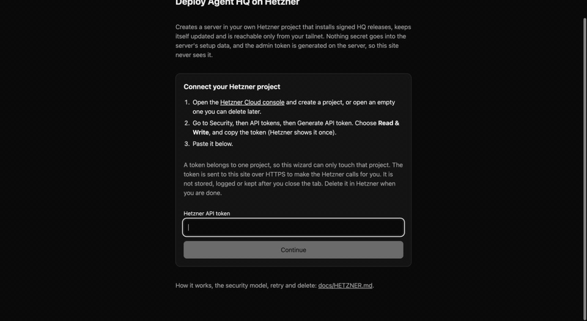

<p align="center">
  
</p>

<h1 align="center">Agent-HQ</h1>

<p align="center">
  <strong>A local-first AI agent hub. Single Rust binary. Your machine, your data, your agents.</strong>
</p>

<p align="center">
  <a href="https://github.com/CalvinMagezi/hq/releases"></a>
  <a href="LICENSE"></a>
</p>

<p align="center">
  <a href="#features">Features</a> •
  <a href="#quick-start">Quick Start</a> •
  <a href="#architecture">Architecture</a> •
  <a href="#security-model">Security</a> •
  <a href="#contributing">Contributing</a> •
  <a href="CHANGELOG.md">Changelog</a>
</p>

---

Agent-HQ (HQ for short) puts one AI agent on every channel you use (Discord, Telegram, a web UI that installs as a PWA, the terminal) and keeps all your data in a markdown vault on your filesystem. Coding agents such as Claude Code, Codex CLI or OpenCode run as supervised harness sessions inside its built-in host (`hq host`).

No cloud backend. No vendor lock-in. One binary of about 58 MB.

---

## Features

- **One agent, every channel.** Discord, Telegram, the web UI and `hq chat` share one conversation history and one memory, so you can switch platforms mid-thread.
- **Markdown vault.** Notes, memory, skills and threads are plain files plus a single SQLite database (FTS5 search and embeddings). Nothing is locked inside a service.
- **Coding-agent sessions.** Start, watch, steer and resume Claude Code, Codex, OpenCode and others in the built-in host, on this machine or a paired one (macOS, Linux, and Windows through WSL2).
- **Sub-agents.** Single, parallel, race and graph execution modes over an in-process agent service.
- **Native tasks.** Spaces, initiatives, tasks and comments, as MCP tools and a list, board and timeline UI.
- **Long-running work.** Turns that outlive the chat ack window detach and report back; `/watch` schedules durable recurring turns.
- **MCP server.** A 2-tool gateway (`hq_discover`, `hq_call`) exposes the full tool registry to Claude Code, Cursor, VS Code, Copilot and other MCP clients.
- **Safety by default.** Bash runs in a sandbox with an environment allowlist, untrusted content is tainted, and `/mcp` refuses requests without a key.
- **Signed self-updates.** Servers pull minisign-verified releases and roll back on a failed health check.
- **Web search out of the box.** `web_search` queries Google, DuckDuckGo, Brave, Mojeek and category engines (news, science, images, code) in-process, with no key and no Docker, then merges and ranks the results. Blocked engines are suspended and remembered across restarts, a server can borrow a better network from a peer HQ, and a SearxNG instance or a Brave API key are optional upgrades. See [docs/WEB_SEARCH.md](docs/WEB_SEARCH.md).
- **Optional integrations.** Google Workspace through the `gws` CLI, remote MCP servers, local models through Ollama. None are required.

---

## How It Works

```
You (PWA / Discord / Telegram / Terminal)
     |
     +-- HQ Control Center PWA  --> Tailscale-secured, installable on any device
     +-- Discord Relay          --> the HQ agent; !cancel to interrupt
     +-- Telegram Relay         --> the HQ agent, photos, documents; !cancel to interrupt
     +-- Terminal Chat          --> Streaming REPL
              |
              v
       hq-web (Axum WS + REST, port 5678)
              |
              v
       .vault/  <-- single source of truth
         |
         +-- _system/   SOUL - MEMORY - CRON-SCHEDULE
         +-- _threads/  cross-platform conversation history
         +-- _logs/     task logs
         +-- _data/     vault.db (SQLite, WAL mode)
         +-- Notebooks/ your notes, memories, projects
```

The vault is the center. Every agent reads from it and writes back to it. Switching platforms mid-conversation does not lose context.

---

## Quick Start

Not a developer? Give [AGENTS-SETUP.md](AGENTS-SETUP.md) to your AI coding agent and ask it to set HQ up for you.

### Quickest: deploy on Hetzner with one form

A private, always-on HQ on your own Hetzner Cloud server, about ten minutes from start to chatting.
It costs Hetzner's hourly price for the server, roughly 6.50 a month for a 4 GB machine, and it is
reachable only from your own [Tailscale](https://tailscale.com) network.

<p align="center">
  
</p>

You need a Hetzner account with a payment method, a free Tailscale account with MagicDNS and HTTPS
certificates turned on, an SSH key (`ssh-keygen -t ed25519` makes one) and a model API key such as OpenRouter.

1. **Make a token.** In the [Hetzner Cloud console](https://console.hetzner.com/projects) create a
   project, then Security, API tokens, Generate. Choose **Read & Write** and copy it once.
2. **Fill in the form** at <https://deploy.agent-hq.online>: paste the token, then pick a name, a
   location, a size with at least 4 GB of memory, your SSH public key and your own IP address.
   Click **Create server**.
3. **Wait 3 to 5 minutes** after Hetzner shows the server as running. It installs HQ by itself.
4. **Join your tailnet.** Run `ssh root@<server-ip> hq-join`, open the Tailscale login link it prints
   and sign in. It then prints your HQ link.
5. **Open HQ.** Open that link on a device on your tailnet, paste your model key on the first
   screen ([what it does](docs/FIRST_RUN.md)), and send a message. Treat the link like a password: it signs you in as admin.
6. **Close public SSH** with the button on the form page once HQ opens. When you are done with the
   server, the same page deletes it together with its firewall and key.

The form never sees the admin token (the server generates it) and nothing secret goes into the
server's setup data. Troubleshooting, the security model and the `hcloud` command-line route:
[docs/HETZNER.md](docs/HETZNER.md).

### Prerequisites

- **Rust** 1.89 or newer (2024 edition): `curl --proto '=https' --tlsv1.2 -sSf https://sh.rustup.rs | sh`
- **At least one LLM API key**: OpenRouter, Anthropic, or Google AI

### Install from Source

```bash
git clone https://github.com/CalvinMagezi/hq.git
cd hq
cargo build --release -p hq-cli
install -m 755 target/release/hq ~/.local/bin/hq    # any directory on your PATH works
```

On macOS, `scripts/install-hq.sh` wraps the same build with code signing and a
launchd service; it is macOS only and not needed on Linux.

### Install a prebuilt binary

With Homebrew: `brew install CalvinMagezi/tap/agent-hq` (binary only).


`curl -fsSL https://agent-hq.online/install.sh | bash` (or `npx agent-hq-cli`, which needs Node 18.17+) downloads the latest stable release, verifies its minisign
signature and checksum, and installs `hq` into `~/.local/bin` and the web UI into
`~/.local/share/agent-hq/web` (`hq start all` then serves it at http://localhost:5678). Prebuilt binaries
exist for Linux x86_64, Linux aarch64 and macOS on Apple Silicon. Other
platforms, including Intel Macs, build from source with `cargo`.

**Docker:** `docker run -d -p 127.0.0.1:5678:5678 -v hq-data:/data ghcr.io/calvinmagezi/hq` runs HQ with its web UI and prints a web token on first start. A Compose example and the details are in [docs/DOCKER.md](docs/DOCKER.md).

The web UI is built separately (see [PWA Dashboard](#pwa-dashboard)) and needs [bun](https://bun.sh).

### Windows

Two editions. **Full HQ** runs inside WSL2 (Ubuntu) with everything, coding agents included, and you
use the web app from your Windows browser. **HQ Lite** is one program in your user profile for work
computers that block WSL2 or installers: the web app, tasks, notes and VS Code over MCP, with no
coding agents. One command picks for you:

```powershell
irm https://agent-hq.online/install.ps1 | iex
```

Details, including running coding agents on a Windows PC for an HQ elsewhere, are in
[docs/WINDOWS.md](docs/WINDOWS.md); the Lite edition and a work-computer checklist are in
[docs/HQ_LITE.md](docs/HQ_LITE.md) and [docs/CORPORATE_WORKSTATION.md](docs/CORPORATE_WORKSTATION.md).

### First Run

On a server you only reach through the browser, the web app asks for your first model key itself:
see [docs/FIRST_RUN.md](docs/FIRST_RUN.md). From a terminal:

```bash
hq install             # scaffold vault, seed soul, write config (~/.hq/config.yaml)
hq env                 # or edit config.yaml: add an LLM API key (OpenRouter, Anthropic or Google)
hq doctor              # verify setup; a missing LLM key is expected until you add one
hq chat                # start an interactive LLM session
hq start all           # or run the daemon, API and web UI on :5678
curl localhost:5678/health
```

### Deploy to a server

For an always-on instance on a Linux VPS, provision the box with
`deploy/setup-vps.sh`, then install the signed pull-based updater:

```bash
# Official releases of this project (verify the key in release/minisign.pub):
sudo deploy/install.sh --repo CalvinMagezi/hq --channel stable --pubkey release/minisign.pub
# Your own fork: --repo <your-owner>/<your-repo> --pubkey <your minisign public key>
hq update --check      # later: see whether a newer release exists
hq update --apply      # or let the systemd timer do it
hq update --rollback   # return to the previous binary
```

The updater is new and has run on two real hosts so far; read
[`docs/UPDATE_SYSTEM.md`](docs/UPDATE_SYSTEM.md) before relying on it. It supports
Linux on x86_64 and aarch64 (Ubuntu 22.04 or newer); `deploy/install.sh` picks the
binary for the host CPU and refuses macOS. The updater verifies a minisign signature, swaps the binary and web files,
restarts, checks `/health` and rolls back on failure. See
[`deploy/README.md`](deploy/README.md) for the full walkthrough (Caddy, Tailscale,
the host, GitHub access) and [`docs/UPDATE_SYSTEM.md`](docs/UPDATE_SYSTEM.md) for the
release format and trust model.

### Configuration

All configuration lives in `~/.hq/config.yaml`:

```yaml
vault_path: /path/to/your/.vault
openrouter_api_key: "your-api-key-here"
default_model: "openai/gpt-6-luna"  # a low-cost default; use "relay" or a premium model id if you prefer
ws_port: 5678

relay:
  discord_token: "your-discord-bot-token-here"
  telegram_token: "your-telegram-bot-token-here"
  discord_enabled: true
  telegram_enabled: true

agent:
  name: "hq-agent"

daemon:
  embedding_batch_size: 10
  embedding_interval_secs: 600

# Optional: bridge remote MCP servers into HQ's tools as <name>_discover / <name>_call.
# remote_mcp:
#   - name: diagrams
#     url: https://example.com/api/mcp
#     api_key: "..."
```

API keys can also be set via environment variables: `OPENROUTER_API_KEY`, `ANTHROPIC_API_KEY`, `GOOGLE_AI_API_KEY`.

### Running models locally

Memory, consolidation and skill review call the LLM router under the aliases
`dream`, `bulk` and `ingest`. To keep them on your machine, either set
`instance.features.local_ollama: true` so the router adds its Ollama routes, or
declare Ollama under `backends:`:

```yaml
backends:
  primary: local
  backends:
    - name: local
      kind: openai-compatible
      endpoint: http://localhost:11434/v1
      model: qwen3:8b
      credential_env: OLLAMA_API_KEY   # must be set, any value such as "ollama"
```

Once `backends:` is set, every alias goes through that chain. Embeddings come
from Ollama's `/api/embeddings` (`EMBEDDING_MODEL`, default `nomic-embed-text`)
whenever no OpenRouter key is configured.

---

## CLI Commands

The `hq` binary ships the commands below. Run `hq help` for full usage.

### Getting Started

| Command | Description |
|---------|-------------|
| `hq install` | Full install: scaffold vault, seed soul content, detect tools, write config (alias `hq setup`) |
| `hq onboard` | Interactive onboarding walkthrough (API keys, tools, integrations) |
| `hq health` | System health check |
| `hq doctor` | Diagnose common issues |
| `hq env` | Set up API keys interactively |
| `hq version` | Show version and build info |
| `hq update [--check\|--apply\|--pin <v>\|--rollback]` | Pull-based signed self-update (see [`docs/UPDATE_SYSTEM.md`](docs/UPDATE_SYSTEM.md)) |

### Chat and Agents

| Command | Description |
|---------|-------------|
| `hq chat` | Interactive terminal chat (default command) |
| `hq sessions [sub]` | Harness sessions: list, spawn <harness>, status, logs, send, stop, resume |

### Services

| Command | Description |
|---------|-------------|
| `hq status` | Show vault status and system info |
| `hq start [component]` | Start components (all, daemon, relay, discord, telegram) |
| `hq stop [component]` | Stop components |
| `hq restart [component]` | Restart components |

### Monitoring

| Command | Description |
|---------|-------------|
| `hq logs [target] [-n N]` | View the last N log lines (target: daemon, relay, all; journald under systemd) |
| `hq logs --errors` | Only error lines |
| `hq logs -f` | Keep streaming new lines |
| `hq ps` | Show all managed processes |

On macOS, the LaunchAgent from `scripts/install-launchagent.sh` runs `hq start all` and logs to `~/Library/Logs/hq-agent.log`, so read it with `hq logs agent`. Plain `hq logs` reads the `daemon` target (`hq-daemon.log`).

### Vault Operations

| Command | Description |
|---------|-------------|
| `hq vault [sub]` | Vault operations (list, tree, read, write, stats, context) |
| `hq search <query>` | Search vault notes (FTS5 full-text search) |
| `hq memory [sub]` | Show/manage memory and system context |
| `hq reindex` | Force a full rebuild of the FTS search index |
| `hq profile` | Generate quality profiles (anti-slop) |

Tasks have no CLI command: they are MCP tools (`task_list`, `task_create` and friends) and the Tasks page in the web UI.

### Agents and Skills

| Command | Description |
|---------|-------------|
| `hq agents [list\|show]` | List/inspect agent definitions |
| `hq mailbox [list\|archive]` | Inspect and maintain the inter-agent mailboxes |
| `hq skills <sub>` | Manage vault skills (list, show, create, validate, adopt, approve, revert, history and more) |
| `hq queue [list\|stats\|clear]` | Inspect or clear the value-bus notification queue |
| `hq decisions [--days N] [--site S]` | Show what the structured-decision gates did |

### Configuration

| Command | Description |
|---------|-------------|
| `hq config [key] [value]` | Show or edit configuration |
| `hq mcp [install\|status\|remove\|doctor] [path] [--target <client>] [--global] [--scope full\|tasks] [--url <https-url>]` | Install/manage the MCP server config for Claude, Cursor, VS Code, Copilot, OpenCode and Antigravity |

### Daemon

| Command | Description |
|---------|-------------|
| `hq daemon [sub]` | Daemon management (stop, status, logs); start it with `hq start daemon` |

### Advanced

| Command | Description |
|---------|-------------|
| `hq kill` | Force-kill all managed processes |
| `hq clean` | Remove stale locks and orphaned files |
| `hq service [install\|uninstall\|status] [target]` | Manage system services (launchd on macOS, systemd on Linux) |
| `hq uninstall [target]` | Remove system services |

### Tools and Models

| Command | Description |
|---------|-------------|
| `hq tools` | Check/install CLI tools (Claude, Gemini, OpenCode) |
| `hq models [sub]` | Manage local models (status, setup, recommend) |
| `hq shortcuts [sub]` | Shortcut tool management and smoke tests (list, test) |

### Usage and Web

| Command | Description |
|---------|-------------|
| `hq usage [sub]` | LLM cost and tokens from `task_outcomes` (summary, daily) |
| `hq cost` | Cost and tokens by model, last 30 days (same as `hq usage summary`) |
| `hq summary` | Cost and tokens by day and model, last 7 days (same as `hq usage daily`) |
| `hq web` | Host the web UI and open it (`--detach`, `--lan`, `--json`; `hq web status`, `hq web stop`). `hq pwa` and `hq dashboard` are aliases |

---

## Architecture

### Crate Structure

Agent-HQ is a Cargo workspace of 17 crates and about 143,000 lines of Rust (556 files, counted on 2026-10-07 without blank lines or comments):

| Crate | Purpose |
|-------|---------|
| `hq-core` | Types, config loading (figment), error types, token counters, microcompact |
| `hq-vault` | Vault I/O: notes, tasks, query builder, frontmatter |
| `hq-db` | SQLite connection pool, FTS5 full-text search, embeddings, graph links |
| `hq-llm` | LLM provider trait + OpenRouter + Ollama integration |
| `hq-agent` | Session loop, sub-agents (`AgentService`), coding tools, governance rules, 5-layer context engine |
| `hq-tools` | About 100 tools (vault, tasks, skills, harness sessions, GWS, remote MCP, etc.); `hq_discover` lists them live |
| `hq-mcp` | MCP stdio server: 2-tool gateway (`hq_discover` + `hq_call`) |
| `hq-daemon` | Agent worker, value bus, memory cycle, email triage |
| `hq-memory` | Memory consolidator, ingester, querier, forgetter, entity graph |
| `hq-relay` | Platform bridge trait, unified bot, cancel/interrupt, background turns, watches |
| `hq-web` | Axum WebSocket server, REST API, embedded static web UI |
| `hq-convert` | Document format conversion utilities |
| `hq-export` | Native note export to PDF, PNG, SVG, HTML, spreadsheets, JSON and more |
| `hq-update` | Signed pull-based updater behind `hq update` |
| `hq-host` | Built-in host for long-lived coding agents: pseudo-terminal panes with a readable screen, a control socket, state detection |
| `hq-sandbox` | Process sandbox policy for one coding agent (`sandbox-exec` on macOS, `bwrap` on Linux) |
| `hq-cli` | The `hq` binary: clap-derived commands |

### Key Dependencies

| Purpose | Crate |
|---------|-------|
| Async runtime | tokio |
| CLI parsing | clap (derive) |
| LLM client | async-openai (base URL swapped to OpenRouter) |
| MCP protocol | rmcp |
| Database | rusqlite (bundled, WAL mode) |
| Serialization | serde, serde_json, serde_yaml |
| Markdown | pulldown-cmark, gray_matter |
| Web server | axum + tower-http |
| Discord | serenity |
| Telegram | teloxide |
| File watching | notify |
| Config | figment (YAML + env) |
| HTTP | reqwest |

---

## Relay Adapters

### Discord

Built-in via the `hq-relay` crate (serenity). Supports streaming responses, slash commands, reactions, and thread management.

```bash
hq start relay       # start Discord relay
```

Send `!cancel` during a running session to gracefully interrupt the agent. The bot replies with a summary of turns completed and files touched before halting.

The heartbeat ticker shows turn count and the current active tool so you can track long-running sessions without polling.

### Telegram

Built-in via the `hq-relay` crate (teloxide). Supports photos, documents, and reply context.

```bash
hq start telegram    # start Telegram relay
```

Send `!cancel` to interrupt the active session. The heartbeat message updates with turn number and tool name during execution. Incoming messages are gated to the authorized owner chat: set `relay.telegram_authorized_chat_id`, or the chat ID is locked on first contact and stored in `_system/.telegram-auth-chat`. See [`docs/TELEGRAM-ACCESS.md`](docs/TELEGRAM-ACCESS.md) and [`docs/DISCORD-ACCESS.md`](docs/DISCORD-ACCESS.md).

### Long-running turns

Relay turns are not killed at a hard wall. Each turn has a configurable ack window (`relay.turn_ack_timeout_secs`, default 270). When a turn outlives the window, the chat gets an immediate ack and the in-flight session detaches into the persisted `background_turns` registry, delivering the result asynchronously when it finishes. Sub-agent spawns are non-blocking; child completion wakes the parked parent with the reports.

On daemon boot, and again every 6 hours, a reconciler sweeps `background_turns`: rows still `running` (listener died or daemon restarted mid-turn) are marked `interrupted`, fresh rows get a notification with a `resume <id>` affordance, and rows older than `relay.background_turn_max_days` (default 5) are retired silently.

Detached turns stay visible in chat. Every `relay.background_progress_secs` (default 300) the relay posts a heartbeat (`Task <id> still running (elapsed Xm).`), and the agent can volunteer mid-turn notes with the `report_progress` tool (`Task <id>: <note>`).

Recurring work uses watches: `/watch <minutes> [for <N>h] <prompt>` registers a durable watch row (`kind='watch'`) that fires the prompt every N minutes, with an optional expiry (`for 4h`); `/unwatch <id>` stops it. Watches are stored in the same registry, so the relay watch scheduler re-dispatches them after a restart. The reconciler leaves live watches alone; watches abandoned past `relay.background_turn_max_days` are interrupted silently.

---

## Daemon

The daemon ticks every 5 seconds and runs 18 interval tasks in three tiers: fast (approvals, harness-session supervision, heartbeat, value-bus delivery, email poll), memory (consolidation, embeddings, note tagging, forgetting), and maintenance (vault health, thread rotation, clean-up, disk watchdog, SQLite vacuum). Two loops run beside the scheduler: the agent worker, which triages inbound events and email, and the machine profile, which records the host's CLIs in `MACHINE.md`.

Status is written to `.vault/DAEMON-STATUS.md` after every tick.

```bash
hq start daemon      # start the background daemon
hq daemon status     # check daemon status
hq daemon logs       # view daemon logs
```

---

## MCP Server

Agent-HQ exposes its full tool registry via MCP (Model Context Protocol) through a 2-tool gateway:

| Tool | Purpose |
|------|---------|
| `hq_discover` | Search the registry by keyword: returns matching tools + descriptions |
| `hq_call` | Execute any tool by name with JSON input |

### Configure for Claude Code

The easiest way is to let `hq` write the config for you:

```bash
hq mcp install --target claude-code   # or claude-desktop, cursor, vscode, copilot, opencode, antigravity, project
hq mcp status                         # show what is installed where
```

To write it by hand, add this to your project `.mcp.json`:

```json
{
  "mcpServers": {
    "agent-hq": {
      "command": "/path/to/hq",
      "args": ["mcp-serve"],
      "env": {
        "HQ_VAULT_PATH": "/path/to/your/.vault"
      }
    }
  }
}
```

### Available Tool Categories

| Category | Examples |
|----------|---------|
| Vault | vault_search, vault_read, vault_list, vault_write_note, vault_context |
| Tasks | task_list, task_create, task_update, task_comment_add |
| Harness sessions | harness_session_spawn, harness_session_send, harness_session_status, host_read |
| Sub-agents | spawn_subagents |
| Web | web_search, web_fetch |
| Image | generate_image |
| Google Workspace | google_workspace |
| Agents | list_agents, load_agent |
| Skills | list_skills, load_skill, skill_manage |
| Remote MCP | `<name>_discover`, `<name>_call` per `remote_mcp:` entry |

---

## PWA Dashboard

The HQ Control Center is a React PWA (TanStack Start + Vite) that connects to the Rust backend via WebSocket. It provides:

- Real-time agent streaming
- Vault search and browsing
- Daemon status monitoring
- Native task management (list, board, timeline)
- Document viewers (DOCX, XLSX, PDF)
- Push notifications

The PWA lives in `apps/hq-web/` and builds to a static single-page app that `hq start all` serves on `:5678` (from `web/dist` next to the vault, or `web_static_dir` in `config.yaml`). For phone access over Tailscale, put `deploy/Caddyfile.pwa` in front and expose it with `tailscale serve`.

The quickest way to see it is `hq web`. It starts only the web server (no daemon, no relays), finds the UI build, and opens your browser. Run twice, it reuses the server already listening instead of failing.

```bash
hq web                      # foreground on http://localhost:5678, opens the browser; Ctrl+C stops it
hq web --detach             # background; returns once it answers, then `hq web status` / `hq web stop`
hq web --lan                # reachable from a phone or another machine; generates a token (see below)
hq web --port 8080 --build  # another port; build the UI from this checkout first (needs bun)
hq web --json               # implies --detach; prints one JSON object: url, login_url, token, pid, log, static_dir
```

`hq web` looks for the UI in `web_static_dir`, then `web/dist` next to the vault, then `apps/hq-web/dist/client` in a checkout, then the install locations. If none exists it builds the UI once with bun (`bun install --frozen-lockfile`, then `bun run build`), but only in the checkout your vault lives in. In any other checkout, such as the current directory, it asks you to pass `--build` first, because a build runs that project's package scripts. A non-loopback bind (`--lan`) requires a token: `hq web` uses `web_auth_token` if set, otherwise it generates one and keeps it in `~/.hq/web.token` (mode 0600) so the link survives restarts. Open the printed sign-in link once; the token travels in the `#token=` fragment, never the query string. `hq web` is for personal use; `hq start all` runs the full instance (daemon and relays) and serves the same UI.

Setting HQ up for someone else? `hq web --json` is the one call to run, and `hq web status --json` (exit code 1 when down) confirms it afterwards.

```bash
bun run dev                 # in apps/hq-web: dev server on :4747, proxies /api and /ws to :5678
```

---

## The Vault

The vault (`.vault/`) is the single source of truth. All agents read from it and write back to it.

### System Files

| File | Purpose |
|------|---------|
| `SOUL.md` | Agent identity and principles |
| `MEMORY.md` | Persistent facts and goals |
| `PREFERENCES.md` | User workflow preferences |
| `CONFIG.md` | System configuration notes |
| `CRON-SCHEDULE.md` | Full cron schedule |
| `HEARTBEAT.md` | Daemon status and pending items |

`DAEMON-STATUS.md`, the last run status of every daemon task, is written at the vault root rather than in `_system/`.

### Directory Structure

```
.vault/
  _system/      system markdown files
  _threads/     conversation history
  _logs/        task logs
  _data/        vault.db (SQLite)
  Notebooks/    user notes, projects, knowledge
```

---

## Context Engine

The context engine (`hq-agent/src/context/`) assembles token-budgeted context frames with 5 layers:

1. **System**: SOUL + harness instructions
2. **UserMessage**: the current user turn
3. **Memory**: long-term facts (private tags stripped)
4. **Thread**: recent messages, older ones compacted
5. **Injections**: pinned notes + search results

Surplus tokens cascade between layers (thread 50%, injections 35%, memory 15%).

---

## Session Runtime

Agent sessions have no application-level turn-count ceiling — a session runs until natural completion, explicit cancellation, budget exhaustion, or the wall-clock limit:

- **Wall-clock limit**: 5 hours by default (configurable via `SessionConfig::max_duration_secs`)
- **Budget cap**: optional, via `SessionConfig::max_budget_usd`

When a limit is hit, the session emits `TimeLimitReached` or `BudgetExhausted` and the relay adapter posts a summary to Discord/Telegram. The summary includes elapsed time and files modified.

Sending `!cancel` via Discord or Telegram triggers a graceful `Cancelled` exit at the next tool boundary, with the same summary. The cancel flag (`Arc<AtomicBool>`) is checked once per turn so in-flight tool calls finish cleanly before the session stops.

---

## Development

```bash
cargo check                        # type-check all crates
cargo test -p hq-tools             # test a specific crate (faster)
cargo test --workspace             # run all tests
cargo build --release -p hq-cli    # release build (about 58 MB)
./scripts/install-hq.sh            # build + install to ~/bin (after a one-time `sudo ./scripts/install-hq.sh --link`)
cargo clippy --workspace --all-targets -- -D warnings   # lint (CI gate)
hq mcp doctor                      # verify MCP connection health
```

### Project Layout

```
crates/          Rust crates
apps/
  hq-web/        PWA dashboard (React + TanStack Start)
deploy/          Deployment scripts and configs
scripts/         Development utilities
Cargo.toml       Workspace root
```

---

## Tech Stack

| Layer | Technology |
|-------|-----------|
| Language | Rust (2024 edition) |
| Runtime | Tokio |
| Data | Markdown vault + YAML frontmatter |
| Database | SQLite (rusqlite, bundled, WAL mode) |
| Search | FTS5 full-text + embedding vectors |
| LLM | OpenRouter / Ollama via async-openai |
| CLI | clap (derive mode) |
| MCP | rmcp |
| Web server | Axum + tower-http |
| Discord | serenity |
| Telegram | teloxide |
| File watching | notify |
| Config | figment (YAML + env vars) |
| PWA | TanStack Start + Vite PWA + React 19 |
| Build | Cargo workspace, LTO + strip in release |

---

## Security model

HQ runs tool-using agents that can execute shell commands, so the deployment shape matters.

- **Local, single user (default).** The web server binds to `127.0.0.1`. Set `web_auth_token` on a shared machine.
- **Private network.** Keep HQ on loopback behind `tailscale serve` or a reverse proxy and list the served origins in `web_allowed_origins`.
- **Public `/mcp`.** Only through a proxy that exposes `/mcp` and `/health` and nothing else, with `AGENTHQ_API_KEY` set. `/mcp` refuses every request without a key. `/ws` and `/api` must never be public.
- **Untrusted content** (web pages, email, documents) is tainted: once a session reads it, secret-file reads and outbound network from bash are denied no matter what the model says.

Read [`SECURITY.md`](SECURITY.md) for the policy and how to report a vulnerability, and the details in [`docs/security/`](docs/security/): [web and MCP auth](docs/security/WEB_AUTH.md), [bash sandbox](docs/security/BASH_SANDBOX.md), [prompt injection](docs/security/PROMPT_INJECTION.md), [`web_fetch` SSRF protection](docs/security/WEB_FETCH.md), [self-update](docs/security/SELF_UPDATE.md) and the [release checklist](docs/security/RELEASE_CHECKLIST.md).

---

## Documentation

| Topic | Doc |
|-------|-----|
| Deploying to a server | [`deploy/README.md`](deploy/README.md) |
| Signed updates | [`docs/UPDATE_SYSTEM.md`](docs/UPDATE_SYSTEM.md) |
| Coding-agent sessions | [`docs/AGENT_HOST.md`](docs/AGENT_HOST.md), [`docs/AGENT_SESSIONS.md`](docs/AGENT_SESSIONS.md) |
| Windows (WSL2) | [`docs/WINDOWS.md`](docs/WINDOWS.md) |
| Adding a machine that runs coding agents | [`docs/JOIN_A_MACHINE.md`](docs/JOIN_A_MACHINE.md) |
| Asking HQ from MCP clients | [`docs/MCP_ASK.md`](docs/MCP_ASK.md) |
| Connecting an agent to a VPS instance | [`docs/VPS_AGENT_CONNECT.md`](docs/VPS_AGENT_CONNECT.md) |
| Native tasks | [`docs/plans/native-tasks.md`](docs/plans/native-tasks.md) |
| Architecture notes | [`docs/architecture/`](docs/architecture/) |
| Agent instructions for this repo | [`CLAUDE.md`](CLAUDE.md), [`AGENTS.md`](AGENTS.md) |

---

## Contributing

HQ's direction is set by its maintainer, so pull requests are limited to the maintainer. Issues are welcome for bugs and ideas, and you are free to fork the project (MIT) and build your own version. See [`CONTRIBUTING.md`](CONTRIBUTING.md) for dev setup, and please follow the [Code of Conduct](CODE_OF_CONDUCT.md). Report security problems privately as described in [`SECURITY.md`](SECURITY.md), not in a public issue.

---

## License

MIT. See [LICENSE](LICENSE).
