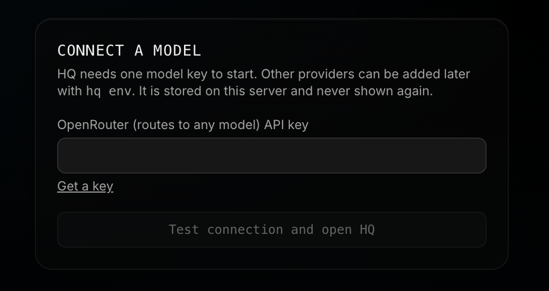

# First run: connecting a model

A new HQ server needs one model API key before it can chat. If you set HQ up on a server you cannot easily type into (the [Hetzner deploy](HETZNER.md), a VPS you only reach through the browser), the web app asks for that key itself, so you never need a terminal for it.

## When you see it

Open HQ in the browser the first time, using the sign-in link your setup printed. If the server has no model key yet, the app sends you to **Connect a model** (`/setup`). You see it once per page load, only when all of these are true:

- no model key exists in the config or in the usual provider environment variables (`OPENROUTER_API_KEY`, `ANTHROPIC_API_KEY`, `GOOGLE_AI_API_KEY`, `GEMINI_API_KEY`);
- the server has a web token, which every server set up from a sign-in link has;
- you are running a release that includes the screen (stable from `v0.9.1-main.99` on).

## What to do

1. Pick a provider and create a key for it:
   - **OpenRouter** (<https://openrouter.ai/keys>): one key reaches many models. The default model is `openai/gpt-6-luna`.
   - **Anthropic** (<https://console.anthropic.com/settings/keys>): Claude models directly. The default model is `anthropic/claude-haiku-5.5`.
   - **Google AI** (<https://aistudio.google.com/apikey>): Gemini models directly. The default model is `google/gemini-2.5-flash`.

   The account needs a little credit. A spending cap or an expiry on the key is a sensible precaution.
2. Paste the key into the field and click **Test connection and open HQ**.
3. HQ opens the chat. Send a message to confirm it answers.

## What the button does

1. **Tests the key.** The server sends one tiny request (one output token, 15 second limit) to the chosen provider with your key. If the provider refuses it, you see the provider's own message, for example `auth error (401): Unauthorized`, and nothing is saved.
2. **Saves it.** On success the server writes the key to its config file (`/opt/hq/config.yaml` on a server install, `~/.hq/config.yaml` otherwise, mode 600). It also sets the default model to that provider's low-cost model (see above), but only if the config still has the stock default (`relay`) or a local `ollama/` model. A model you chose on purpose is kept. Local-only mode is switched off so the key is used.
3. **Needs no restart.** HQ reads its config on every chat turn, so the next message uses the new key.

## What protects the key

- The key is sent only to your own HQ server over your tailnet or HTTPS, and from there only to the chosen provider's fixed address. It is never returned by the API, never written to logs, and scrubbed from any error text.
- The setup endpoints refuse to run on a server without a web token. They do not make an exception for requests that look local, because behind a proxy or `tailscale serve` every request looks local.
- They refuse once any key exists (`409`), so the screen cannot be used to swap keys later. Use the **Settings** page to see which providers are configured, or `hq env` on the server to change them.
- Like other changes from the web app, the requests need the `X-HQ-Client` header, which a page on another site cannot add.

## When it does not appear

- **A key already exists.** Open **Settings** to see which providers are configured. To change one, use `hq env` or edit `config.yaml`.
- **Local use without a web token.** On `localhost` with no token the screen is unavailable by design (`403`: "first-run setup needs a web token"). Run `hq env` or add `openrouter_api_key` to `~/.hq/config.yaml`.
- **An older release.** Servers that installed before the screen shipped have no `/setup`. Update with `hq update --apply`, or follow the terminal route.

## Problems and fixes

| What you see | Cause and fix |
|---|---|
| `auth error (401): Unauthorized` | The provider rejected the key. Check for a stray character, an expired key or a key from another service. |
| `rate limited` or `provider overloaded` | The provider is busy or the key hit its cap. Try again or raise the cap. |
| `the provider did not answer in time` | No answer within 15 seconds. Check that the server can reach the internet, then retry. |
| `that does not look like an API key` | The field is empty, longer than 512 characters or contains a space. Paste only the key. |
| `a model key is already configured` (`409`) | Someone, or an environment variable, already set a key. Reload the page. |
| The page loads but every panel shows `401` | The browser did not keep the sign-in token. Open the sign-in link again in a fresh tab. |
| Chat says no provider is available | The server runs an older release, from before Anthropic and Google keys in the config file reached the chat router. Update with `hq update --apply`, or use an OpenRouter key. |

## Which models a direct key serves

A direct Anthropic key serves `anthropic/claude-haiku-5.5` (the default), `anthropic/claude-sonnet-5.5` and `anthropic/claude-opus-5.5`. A direct Google key serves `google/gemini-2.5-flash` (the default) and `google/gemini-2.5-pro`. Any other model id is not pinned to those keys: it goes to whichever configured provider accepts it, which is OpenRouter if you have a key for it. To use another Gemini model with a Google key, set the model to `gemini/<model id>`.

## Using other providers

The screen offers the three providers above because their keys go straight into the config fields the chat router reads (`openrouter_api_key`, `anthropic_api_key`, `google_ai_api_key`). For DeepSeek, OpenAI, Groq, Cerebras, Kimi or local models, see **Configuration** in the [README](../README.md#configuration) and the `backends:` section.
